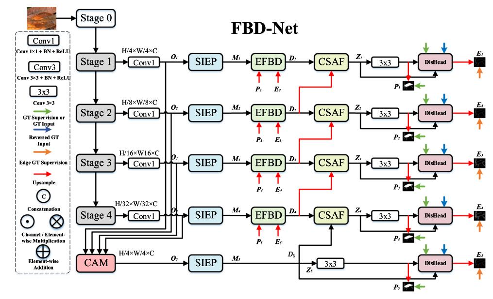
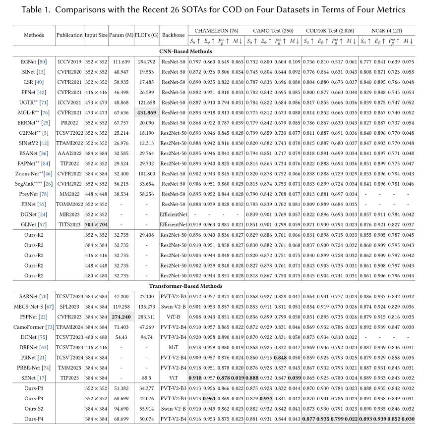
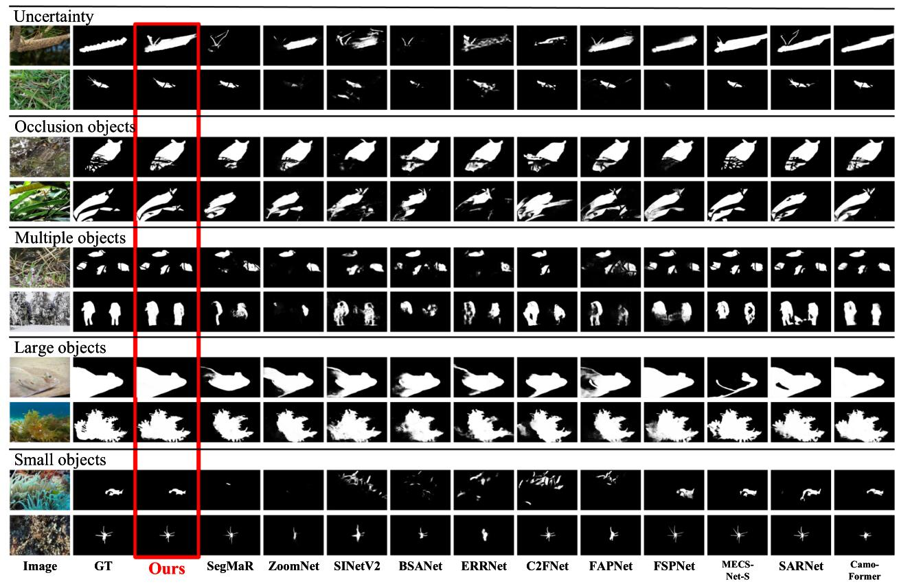

# Boosting Foreground-Background Disentanglement for Camouflaged Object Detection (ACM TOMM 2025)

> **Authors:** 
> Jiesheng Wu,
> Fangwei Hao,
> and Jing Xu.

> **Institutions:** 
> School of Computer and Information, Anhui Normal University, Wuhu, China;
> College of Artificial Intelligence, Nankai University, Tianjin, China

## 1. Preface

- This repository provides code for "_**Boosting Foreground-Background Disentanglement for Camouflaged Object Detection**_" ACM TOMM 2025. [Paper](https://dl.acm.org/doi/10.1145/3768584) 

## 2. Overview

### 2.1. Introduction

In nature, certain objects exhibit patterns that closely resemble their backgrounds, a phenomenon commonly referred to as Camouflaged Object Detection (COD). We argue that existing COD approaches often suffer from insufficient discriminability for these objects, which we attribute to a lack of effective disentangling of foreground and background representations. To address this, we propose a novel Foreground-Background Disentanglement Network (FBD-Net) that enhances foreground-background disentanglement learning to
improve discriminability. Specifically, we design an Edge-guided Foreground-Background Decoupling (EFBD) module, which facilitates the separated learning of foreground and background representations. Additionally, we introduce the Foreground-Background Representation Disentangling Head (DisHead) to further boost the discriminative power of the model. The DisHead consists of two objectives: the Edge Objective and the FoBa Objective. Furthermore, we propose three complementary modules: the Context Aggregation Module (CAM) for initial coarse object detection, the Scale-Interaction Enhanced Pyramid (SIEP) for multi-scale information extraction, and the Cross-Stage Adaptive Fusion (CSAF) module for subtle clue accumulation. Extensive experiments demonstrate that both our CNN-based and Transformer-based FBD-Nets outperform 26 state-of-the-art COD methods across four public datasets.

### 2.2. Framework Overview

      
    <em> 
    Figure 1:  Overall architecture of the proposed FBD-Net. FBD-Net consists of five key components: a CAM, a SIEP, an EFBD module, a CSAF module, and a DisHead.
    </em>

### 2.3. Quantitative Results

      
    <em> 
    Figure 2: Quantitative Results
    </em>

### 2.4. Qualitative Results

      
    <em> 
    Figure 3: Qualitative Results.
    </em>

## 3. Proposed Method

### 3.1. Training/Testing

The training and testing experiments are conducted using [PyTorch](https://github.com/pytorch/pytorch) with two NVIDIA Tesla V100 GPUs of 32 GB Memory.

1. Configuring your environment (Prerequisites):
       
    + Installing necessary packages: `pip install -r requirements.txt`.

1. Downloading necessary data:

    + downloading training dataset and move it into `./data/`, 
    which can be found from [Baidu Drive](https://pan.baidu.com/s/1zLYWsxxluq1elQuyY7gg3w) (extraction code: ekd2). 

    + downloading testing dataset and move it into `./data/`, 
    which can be found from [Baidu Drive](https://pan.baidu.com/s/1xnaiHnAuj4UVTPRak9oU2g) (extraction code: nhwe). 
        
    + downloading our weights and move it into `./save_models/res_199.pth` or `./save_models/swin_199.pth`, 
    which can be found from [(Baidu Drive)](https://pan.baidu.com/s/1ONrkzCl1yoVEp2b9dbeFhQ) (extraction code: j1zt). 
    
    + downloading Res2Net or Swin V2 weights and move it into `./pre_train/res2net50_v1b_26w_4s-3cf99910.pth` or `./pre_train/swinv2_base_patch4_window12to24_192to384_22kto1k_ft.pth`,
    which can be found from [Baidu Drive](https://pan.baidu.com/s/18K3Rpk44Bu7JPq36aX1-PQ) (extraction code: izc5). 

1. Training Configuration:

    + After you download training dataset, just run `MyTrain.py` to train our model.

1. Testing Configuration:

    + After you download all the pre-trained model and testing dataset, just run `MyTest.py` to generate the final prediction maps.
    
    + You can also download prediction maps ('CHAMELEON', 'CAMO', 'COD10K', 'NC4K') from [Baidu Drive](https://pan.baidu.com/s/1VG3ftr5yzIOg9VSdN1149w) (extraction code: iuu6)).

### 3.2 Evaluating your trained model:

One evaluation is written in Python code ([link](https://github.com/lartpang/PySODMetrics)), 
please follow this the instructions in `MyEval.py` and just run it to generate the evaluation results.

## 4. Citation

Please cite our paper if you find the work useful, thanks!
	
@article{wu2025boosting,
  title={Boosting Foreground-Background Disentanglement for Camouflaged Object Detection},
  author={Wu, Jiesheng and Hao, Fangwei and Xu, Jing},
  journal={ACM Transactions on Multimedia Computing, Communications and Applications},
  volume={21},
  number={12},
  pages={1--23},
  year={2025},
  publisher={ACM New York, NY}
}
**[⬆ back to top](#1-preface)**
